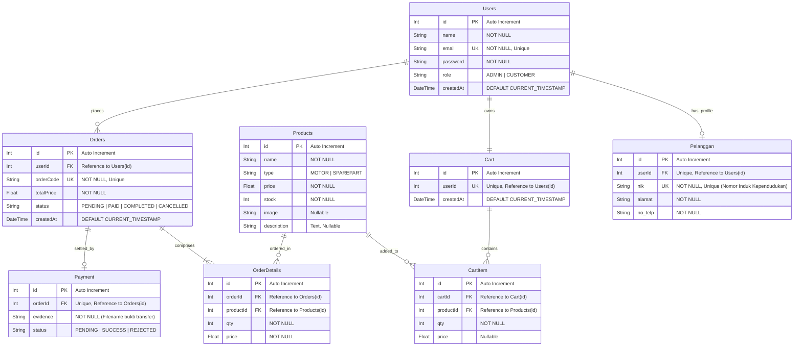
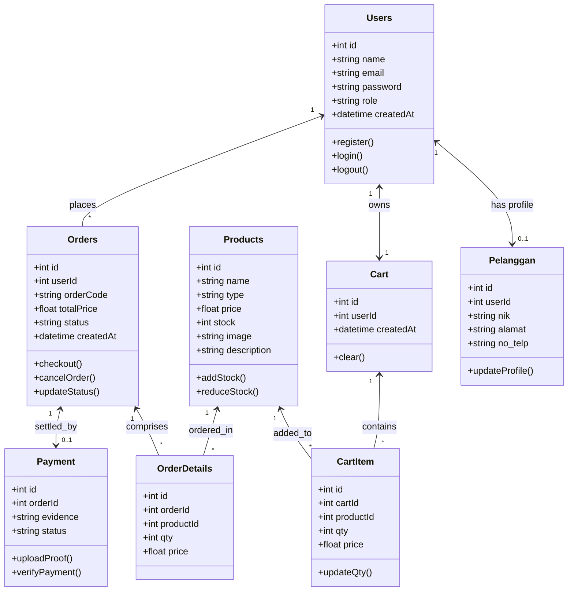

# Database & Class Diagram - Showroom Motor

Dokumen ini mendokumentasikan skema database untuk aplikasi **Showroom Motor**, yang dibagi menjadi dua versi:
1. **Conceptual ERD (Notasi Chen)**: Digunakan untuk mempresentasikan konsep logika database secara akademis (entitas, relasi belah ketupat, dan atribut oval).
2. **Physical/Relational ERD (Notasi Crow's Foot)**: Digunakan untuk implementasi fisik tabel database MySQL.

---

## 1. Conceptual ERD (Notasi Chen)

Berikut adalah diagram relasi antartabel menggunakan **Notasi Chen**. Notasi ini sangat rapi karena memetakan entitas sebagai persegi panjang, relasi sebagai belah ketupat, dan atribut sebagai oval (stadium). Teks bergaris bawah menunjukkan atribut kunci (*Primary Key*).

> [!NOTE]
> File diagram SVG interaktif untuk Notasi Chen dapat dibuka langsung melalui browser di: [erd_showroom.svg](file:///d:/ujikel/showroom-motor/erd_showroom.svg).

```mermaid

graph TD
    %% Styling
    classDef entity fill:#1e1b4b,stroke:#818cf8,stroke-width:2px,color:#fff;
    classDef relation fill:#311042,stroke:#d946ef,stroke-width:2px,color:#fff;
    classDef attribute fill:#0f172a,stroke:#475569,stroke-width:1px,color:#cbd5e1;
    classDef keyAttribute fill:#0f172a,stroke:#fbbf24,stroke-width:1.5px,color:#fbbf24;

    %% Entities (Rectangles)
    E_Pelanggan[Pelanggan]:::entity
    E_Cart[Cart]:::entity
    E_Products[Products]:::entity
    E_Orders[Orders]:::entity
    E_Payment[Payment]:::entity

    %% Relationships (Diamonds)
    R_Memiliki{Memiliki}:::relation
    R_Menyimpan{Menyimpan}:::relation
    R_Melakukan{Melakukan}:::relation
    R_Membeli{Membeli}:::relation
    R_Dibayar{Dibayar}:::relation

    %% Attributes of Pelanggan (Ovals)
    A_Pel_Id([<u>id_user</u>]):::keyAttribute
    A_Pel_Nama([nama]):::attribute
    A_Pel_Email([email]):::attribute
    A_Pel_Nik([<u>nik</u>]):::keyAttribute
    A_Pel_Alamat([alamat]):::attribute
    A_Pel_Telp([no_telp]):::attribute

    E_Pelanggan --- A_Pel_Id
    E_Pelanggan --- A_Pel_Nama
    E_Pelanggan --- A_Pel_Email
    E_Pelanggan --- A_Pel_Nik
    E_Pelanggan --- A_Pel_Alamat
    E_Pelanggan --- A_Pel_Telp

    %% Attributes of Cart (Ovals)
    A_Cart_Id([<u>id_cart</u>]):::keyAttribute
    A_Cart_Created([created_at]):::attribute

    E_Cart --- A_Cart_Id
    E_Cart --- A_Cart_Created

    %% Attributes of Products (Ovals)
    A_Prod_Id([<u>id_product</u>]):::keyAttribute
    A_Prod_Nama([nama_produk]):::attribute
    A_Prod_Tipe([tipe_produk]):::attribute
    A_Prod_Harga([harga]):::attribute
    A_Prod_Stok([stok]):::attribute
    A_Prod_Desc([deskripsi]):::attribute

    E_Products --- A_Prod_Id
    E_Products --- A_Prod_Nama
    E_Products --- A_Prod_Tipe
    E_Products --- A_Prod_Harga
    E_Products --- A_Prod_Stok
    E_Products --- A_Prod_Desc

    %% Attributes of Orders (Ovals)
    A_Ord_Id([<u>id_order</u>]):::keyAttribute
    A_Ord_Code([<u>order_code</u>]):::keyAttribute
    A_Ord_Total([total_price]):::attribute
    A_Ord_Status([status]):::attribute
    A_Ord_Created([created_at]):::attribute

    E_Orders --- A_Ord_Id
    E_Orders --- A_Ord_Code
    E_Orders --- A_Ord_Total
    E_Orders --- A_Ord_Status
    E_Orders --- A_Ord_Created

    %% Attributes of Payment (Ovals)
    A_Pay_Id([<u>id_payment</u>]):::keyAttribute
    A_Pay_Evidence([bukti_transfer]):::attribute
    A_Pay_Status([status_pembayaran]):::attribute

    E_Payment --- A_Pay_Id
    E_Payment --- A_Pay_Evidence
    E_Payment --- A_Pay_Status

    %% Attributes on Relationships (Attributes on M:N)
    A_Rel_Menyimpan_Qty([qty]):::attribute
    R_Menyimpan --- A_Rel_Menyimpan_Qty

    A_Rel_Membeli_Qty([qty]):::attribute
    A_Rel_Membeli_Price([harga_beli]):::attribute
    R_Membeli --- A_Rel_Membeli_Qty
    R_Membeli --- A_Rel_Membeli_Price

    %% Connection Lines (Cardinality)
    E_Pelanggan -- "1" --- R_Memiliki
    R_Memiliki --- "1" -- E_Cart

    E_Cart -- "M" --- R_Menyimpan
    R_Menyimpan --- "N" -- E_Products

    E_Pelanggan -- "1" --- R_Melakukan
    R_Melakukan --- "M" -- E_Orders

    E_Orders -- "M" --- R_Membeli
    R_Membeli --- "N" -- E_Products

    E_Orders -- "1" --- R_Dibayar
    R_Dibayar --- "1" -- E_Payment
```

---

## 2. Physical/Relational ERD (Notasi Crow's Foot)

Berikut adalah diagram fisik (Physical ERD) yang menggambarkan skema tabel database MySQL dan tipe datanya yang terimplementasi pada backend aplikasi:

> [!NOTE]
> File diagram SVG fisik untuk Notasi Crow's Foot dapat dibuka langsung melalui browser di: [erd_physical_showroom.svg](file:///d:/ujikel/showroom-motor/erd_physical_showroom.svg).



---

## 3. Struktur Kelas (Class Diagram)

Class Diagram menggambarkan hubungan kelas, atribut, serta metode (operasi) pada aplikasi showroom motor:



---

## 4. Penjelasan Logika Alur Relasi (Sesuai Aplikasi Web)

Mengapa relasi di atas adalah alur yang benar dan masuk akal?

1. **Alur dari Users ke Orders (`Users` ─── `Orders`)**:
   Pengguna dengan role `CUSTOMER` melakukan pemesanan kendaraan/suku cadang, sehingga terbentuk record baru di tabel `Orders` yang mencatat siapa pembuat pesanan tersebut (`userId`). Ini merepresentasikan kepemilikan transaksi.
   
2. **Alur dari Orders ke Products (`Orders` ─── `OrderDetails` ─── `Products`)**:
   Sebuah transaksi/pesanan (`Orders`) tidak boleh langsung terhubung ke `Products` secara 1-to-Many atau Many-to-One.
   * Jika dihubungkan langsung dari `Orders` ke `Products` (misal ada kolom `productId` di tabel `Orders`), maka satu pesanan hanya bisa memuat **1 jenis produk saja**.
   * Jika dihubungkan langsung dari `Products` ke `Orders` (misal kolom `orderId` ada di tabel `Products`), satu produk hanya bisa dibeli oleh satu transaksi seumur hidupnya (stok produk menjadi tidak berguna).
   * **Solusi Logis:** Menggunakan tabel perantara **`OrderDetails`** (relasi Many-to-Many). Satu pesanan bisa memuat banyak item produk, dan masing-masing item mencatat kuantitas (`qty`) serta harga beku saat transaksi (`price`).

3. **Logika Harga Beku (`price` di `OrderDetails` & `CartItem`)**:
   Tabel `OrderDetails` menyimpan kolom `price` pada saat checkout dilakukan. Hal ini sangat penting karena harga produk di tabel `Products` dapat berubah di masa depan (misal karena inflasi atau diskon). Tanpa harga beku di `OrderDetails`, laporan keuangan masa lalu akan berubah jika harga produk diperbarui.

4. **Alur dari Orders ke Payment (`Orders` ─── `Payment`)**:
   Setelah pesanan (`Orders`) dibuat dengan status `PENDING`, sistem akan menunggu pembayaran. Ketika pengguna mengunggah bukti transfer bank, data tersebut disimpan di tabel `Payment` yang terhubung secara **One-to-One** ke `Orders` melalui `orderId`.
   * **Catatan Logis untuk Guru:** Pembayaran tidak boleh terhubung langsung ke `Products`. Pengguna membayar total tagihan dari **seluruh pesanan** (yang bisa berisi beberapa produk sekaligus), bukan membayar per produk secara terpisah. Oleh karena itu, bukti pembayaran mereferensikan `orderId`.
   
5. **Peran Tabel `Pelanggan`**:
   Tabel `Pelanggan` bertindak sebagai profil data diri tambahan (seperti NIK KTP, Alamat Lengkap, dan Nomor Telepon) yang terhubung ke akun utama `Users`. Hal ini sangat penting untuk showroom motor karena dokumen pembeli diperlukan untuk kepengurusan surat kendaraan (STNK/BPKB) secara hukum.
